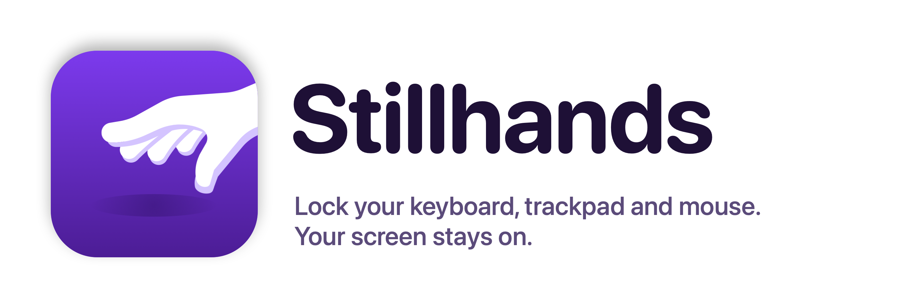
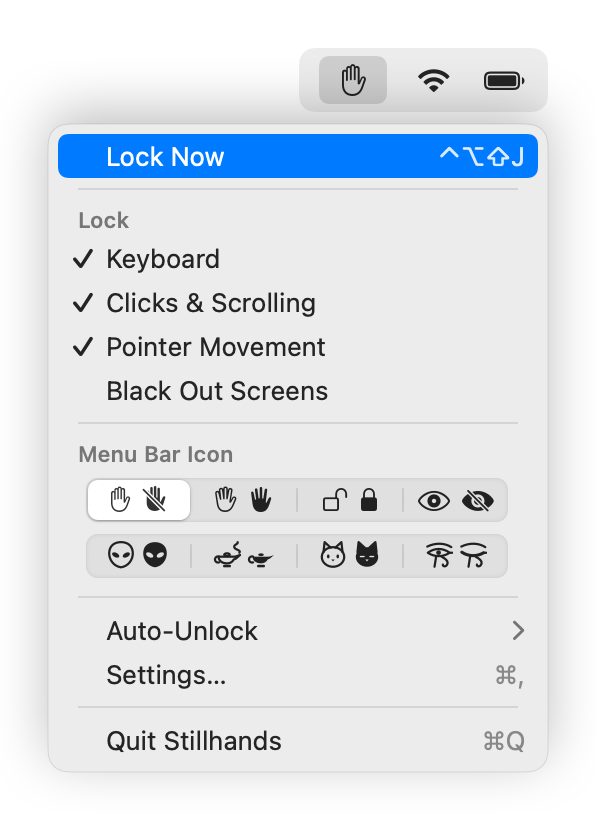
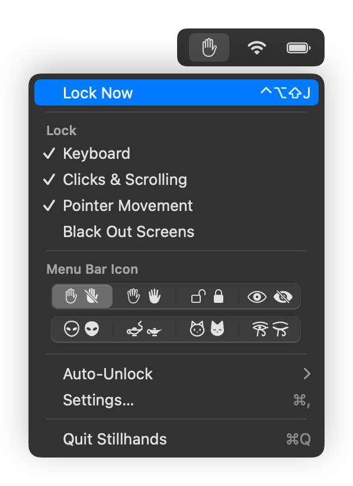
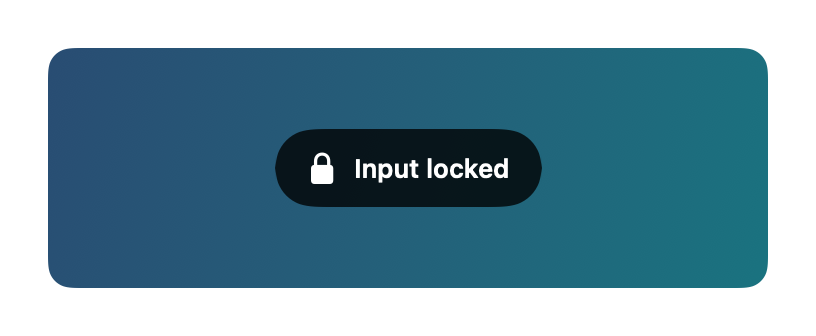
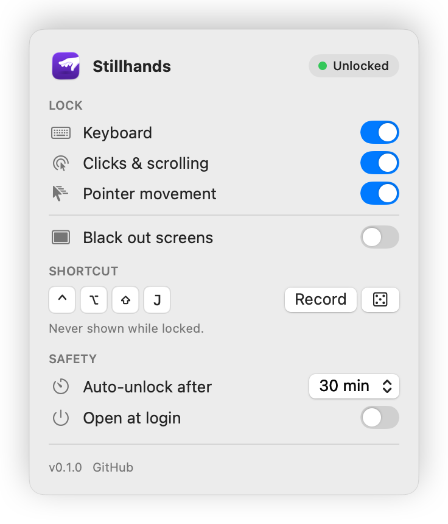
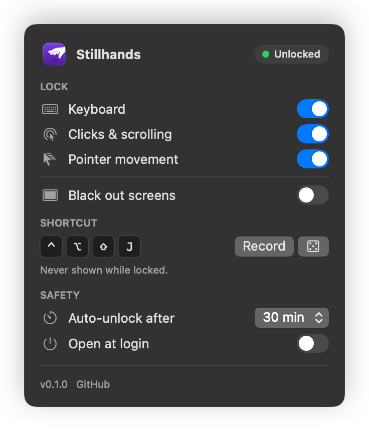

<p align="center">
  <picture>
    <source media="(prefers-color-scheme: dark)" srcset="assets/banner-dark.png">
    
  </picture>
</p>

<p align="center">A tiny, open-source <b>keyboard lock</b> and <b>mouse lock</b> for macOS.</p>

<p align="center">
  <a href="LICENSE"></a>
  
  <a href="https://github.com/fukislim/stillhands/actions/workflows/ci.yml"></a>
</p>

<p align="center">
  
  
</p>

## Why

Sometimes you want your Mac to keep showing something while nobody can touch it:

- a toddler watching a video, or a video call with the grandparents
- the cat walking across the keyboard
- wiping the keyboard and trackpad clean (turn on **Black out screens** so smudges show up)
- a presentation, recipe or dashboard that has to stay put
- an AI coding agent working while you grab a drink, with its progress on screen for everyone to see

Stillhands is a keyboard lock, mouse lock and trackpad lock in one. Press your shortcut and input stops. The screen stays awake and visible. Press the same shortcut again and everything works again.

| | Screen | Locks | Unlock |
|---|---|---|---|
| **Stillhands** | Stays on and visible (black-out optional) | Keyboard, clicks & scrolling, pointer: pick any | Your own shortcut |
| Keyboard Lock (App Store) | Blacked out | Keyboard, mouse, trackpad | Fixed ⌘⇧⎋ |
| KeyboardCleanTool | Darkened | Keyboard, optionally trackpad & mouse | Hold a mouse button |

deadkeys and KeyClean are good too, but they only lock the keyboard.

### Leave your AI agents working in plain sight

Running Claude Code, Codex, Cursor, Aider or another AI coding agent? Lock your Mac and go get a coffee. The screen stays on and the Mac stays awake, so your agents keep working and their progress stays visible. Anyone walking past sees what you're working on and that the work is moving along (not that you're slacking off). Nobody can type into your terminal, approve a prompt or close a window while you're away.

For longer breaks, set **Auto-unlock after** to 60 min or Off in the ✋ menu, and leave **Black out screens** off so the agents' output stays readable.

## Install

With [Homebrew](https://brew.sh):

```sh
brew install --cask fukislim/tap/stillhands
```

Then open Stillhands and grant **Accessibility** access when asked (System Settings › Privacy & Security › Accessibility). Stillhands needs it to block input.

Or manually:

1. Download `Stillhands-x.y.z.zip` from [Releases](https://github.com/fukislim/stillhands/releases), unzip it, and move **Stillhands.app** to `/Applications`.
2. Open it. The build is ad-hoc signed, not notarized, so macOS blocks the first launch:
   - **macOS 15 and later:** open System Settings › Privacy & Security, scroll down and click **Open Anyway**.
   - **macOS 13–14:** right-click the app, choose **Open**, then confirm.
   - Or in Terminal: `xattr -dr com.apple.quarantine /Applications/Stillhands.app`
3. Grant **Accessibility** access when asked (System Settings › Privacy & Security › Accessibility). Stillhands needs it to block input.

A ✋ appears in your menu bar. It changes while locked (a crossed-out hand, by default), and is dimmed until Accessibility access is granted.

## Use

- **Lock:** press your shortcut, or click ✋ (one or two fingers) › **Lock Now**.
- **Unlock:** press the same shortcut again.
- **Quick options:** the ✋ menu toggles what gets locked, black-out and the auto-unlock timer with one click.
- **Menu bar icon:** pick a style right in the ✋ menu, from a basic row (hand, spread hand, padlock, eye) and a funky row (alien, genie lamp, cat, Eye of Horus). Each option previews its unlocked and locked look side by side.
- **Settings…** (⌘,) opens the full window: record or randomize the shortcut, open at login.
- **Forgot it?** The safety timer unlocks on its own (30 minutes by default).

On first launch Stillhands picks a **random shortcut** such as ⌃⌥⇧J. It's shown next to **Lock Now** in the menu. Remember it: it is never shown on screen while locked, and the menu hides it while locked too.

<p align="center">
  
</p>

<p align="center">
  
  
</p>

## Settings

These are all the settings there are. The shortcut and Open at login live in Settings…; everything else is in the ✋ menu (and most of it in Settings too).

| Setting | Default | What it does |
|---|---|---|
| Keyboard | On | Blocks every key, including media, volume and brightness keys. Your shortcut still works. |
| Clicks & scrolling | On | Blocks mouse buttons, taps, scrolling and trackpad gestures. |
| Pointer movement | On | Freezes the cursor where it is. |
| Black out screens | Off | Also covers every display with black while locked. |
| Shortcut | Random | **Record** your own (at least two modifier keys) or roll a new one with 🎲. |
| Auto-unlock after | 30 min | Safety net: unlocks by itself. Off / 5 / 15 / 30 / 60 min. |
| Menu bar icon | Hand | Basic: Hand, Spread Hand, Padlock, Eye. Funky: Alien, Genie Lamp, Cat, Eye of Horus. |
| Open at login | Off | Starts Stillhands when you log in. |

## Security & privacy

- **Random shortcut.** You get a three-modifier combo such as ⌃⌥⇧J, which is hard to hit by accident (or by a curious kid). Combos that macOS already uses (screenshots, lock screen, Spotlight, Force Quit, …) are refused.
- **Never shown while locked.** The "Input locked" banner doesn't reveal how to unlock.
- **No surprises with passwords.** Stillhands refuses to lock while a password field is focused (see below).
- **Nothing leaves your Mac.** No network access, no analytics. Accessibility access is used only to block input.

## Known limits

- **Password fields.** While a password field has focus, macOS turns on Secure Input and hides keystrokes from all apps, including Stillhands. Stillhands therefore won't lock at that moment, because it couldn't see your unlock shortcut.
- **Hardware buttons.** The power / Touch ID button and a forced restart can't be blocked. That's also your last-resort escape.
- **Key labels use the US layout.** On other layouts the shortcut is the same physical keys, but the label may show a different character.
- **Release builds are ad-hoc signed** (no paid Apple Developer ID). Updating to a new release (also via `brew upgrade`) therefore asks for Accessibility again: remove Stillhands from the Accessibility list with **−** and add it again. Until you do, the ✋ in the menu bar is dimmed.
- **Fails open.** If Stillhands quits or crashes while locked, input comes straight back.

## Build from source

You need Swift 6 (Xcode or just the Command Line Tools). Releases are built on GitHub's macOS 15 runners with a macOS 13 deployment target, so the app runs on macOS 13 Ventura and later.

```sh
make signing
make test
make run
make docs
make icon
```

| Command | Does |
|---|---|
| `make signing` | Once per machine: a local signing certificate in its own keychain file, so macOS keeps Accessibility access across rebuilds. Its random password goes into the git-ignored `.env` (see `.env.example`). |
| `make test` | Unit tests. |
| `make run` | Builds `dist/Stillhands.app` (universal) and opens it. |
| `make docs` | Re-renders the screenshots in `docs/images`. |
| `make icon` | Re-draws the app icon, `assets/logo.png` and the README banners from `assets/palm-down-hand.svg`. |

```
Sources/StillhandsCore   pure logic: shortcuts, reserved combos, the event policy (unit-tested)
Sources/Stillhands       the app: event tap, menu bar, settings window, HUD, black-out, docs renderer
scripts/                 build, signing, icon, screenshot and Homebrew cask scripts
```

How it works: a single `CGEventTap` sees every input event. The pure `EventPolicy` decides whether to pass it, block it or toggle the lock. While locked, a display-sleep assertion keeps the screen awake.

### Releasing

Pushing to the **`prod`** branch publishes a release. GitHub Actions tests and builds the app, then creates the GitHub Release `v<version>` with the zip attached. The version comes from `CFBundleShortVersionString` in `Resources/Info.plist`; if that version is already released, the run is skipped. So to ship: bump the version (and `CHANGELOG.md`) on `main`, then `git push origin main:prod`.

The same run updates the Homebrew cask in [`fukislim/homebrew-tap`](https://github.com/fukislim/homebrew-tap) (generated by `scripts/make-cask.sh`). It pushes with an SSH deploy key that can write only to the tap: the public key is a deploy key on `fukislim/homebrew-tap`, and the private key is the secret `HOMEBREW_TAP_DEPLOY_KEY` in this repository. Without the secret the tap step is skipped.

## Contributing

Issues and pull requests are welcome. Stillhands is deliberately small: new settings need a very good reason. Run `make test` before opening a PR.

## License

[MIT](LICENSE). The hand in the logo is the "palm down hand" from [Twemoji](https://github.com/jdecked/twemoji) (© Twitter, Inc. and other contributors), licensed under [CC BY 4.0](https://creativecommons.org/licenses/by/4.0/) and recoloured.
